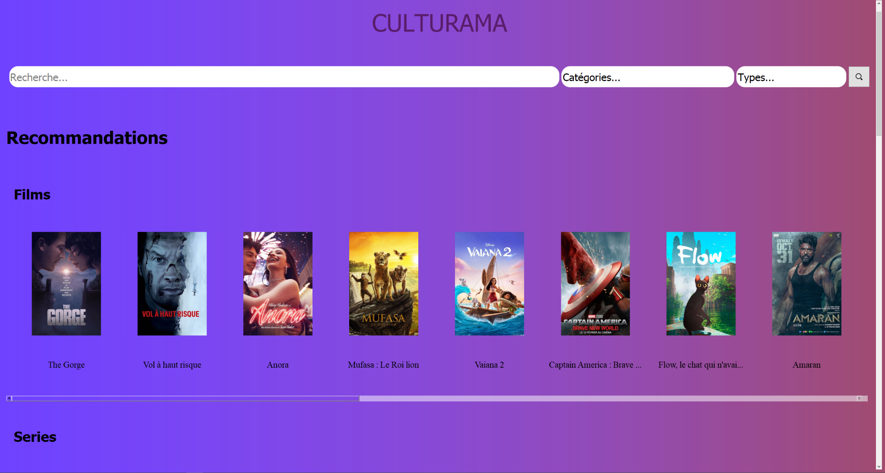
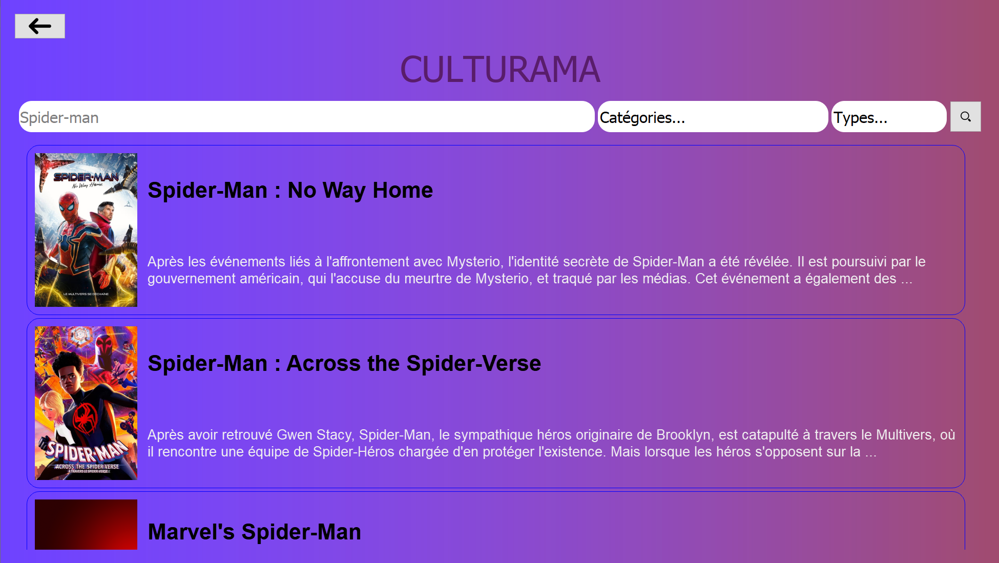
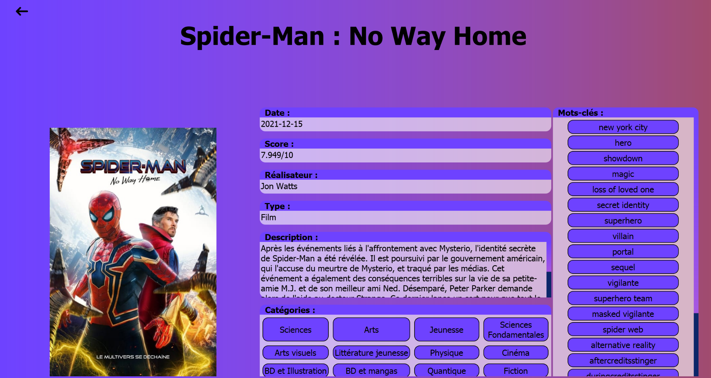

# 🎨 Culturama

Culturama is a **desktop application** developed in **Python (PyQt5)** that provides an intuitive and interactive way to explore a large database of cultural works — including books, films, artworks, and more.  
It was originally created as a second-year university project at **Université Paris Cité (UFR Maths-Info)**.

---

## 📖 Context

The goal of Culturama is to **facilitate access to culture** by offering users a clear, ergonomic, and visually appealing interface to discover and learn about various cultural works.  
Through its search system, category hierarchy, and recommendation engine, Culturama makes cultural exploration simple and enjoyable.

The project was developed collaboratively by a team of four students under the supervision of **Raphaël Braud-Mussi**.

---

## ⚙️ Current Features

✅ **Functional application** — fully operational executable built with PyInstaller  
✅ **Graphical interface** developed with **PyQt5** and styled using **QSS (Qt Style Sheets)**  
✅ **Multi-screen navigation**:
- Home screen with search bar and recommendations  
- Intermediate results screen with filtered search  
- Detailed work page with metadata and similar recommendations  
✅ **Search algorithm** combining SQL queries, category hierarchy, and relevance ranking  
✅ **Recommendation system** based on keyword similarity between works  
✅ **SQLite database** optimized for fast queries and structured relations between works and categories  
✅ **Data integration** from public APIs and verified manual checks for accuracy  
✅ **Continuous integration** throughout the project (Agile methodology)

---

## 🚧 Project Status

Culturama is **functional but not yet complete**.  
Several parts can still be **refined, expanded, and optimized**, both technically and visually.

---

## 🔮 Possible Improvements

✨ **Online database hosting** — to enable data sharing and remote access  
✨ **User system** — allowing favorites, profiles, and personalized recommendations  
✨ **Web or mobile port** — adapting the application for broader accessibility  
✨ **Improved search engine** — faster, more intelligent search and filtering  
✨ **More content sources** — expand API integration and cultural coverage  
✨ **Enhanced UI/UX design** — smoother transitions, animations, and theming options  

---

## 🧠 Technologies Used

- **Python 3**
- **PyQt5** (GUI framework)
- **Qt Designer** (UI prototyping)
- **SQLite3** (relational database)
- **QSS** (interface styling)
- **PyInstaller** (executable packaging)
- **Figma** (UI mockups)

---

## 👥 Team

| Name | Role |
|------|------|
| **Mohamed Belharrat** | Interface development |
| **Ilian Deqqaq** | Database design & integration |
| **Simeon Takenne-Mekem** | Algorithm implementation |
| **Inès Meslem** | Algorithm design & testing |
| **Raphaël Braud-Mussi** | Project supervisor |

---

## 🧩 License

The project uses the **GPL v3 license** (inherited from PyQt5).  
It is **open-source**, and the code can be freely used, modified, and shared for non-commercial purposes.

---

## 💬 Note

> This project was originally developed as part of an academic program.  
> It is currently **functional but still evolving**, and contributions or suggestions for improvement are welcome!

---

### 🖼️ Screenshots

**Home Screen**

**Search Interface**

**Work Details View**

---

**Culturama – Explore culture, simply.**
